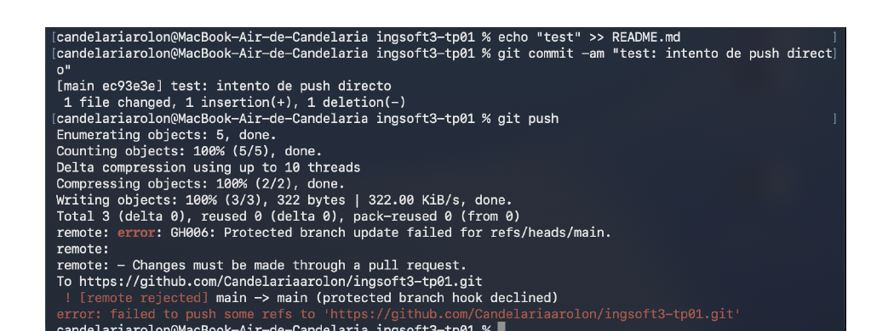
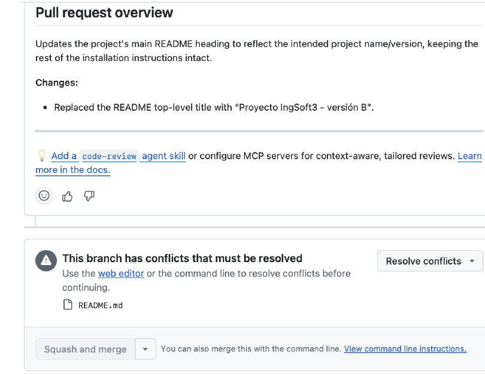
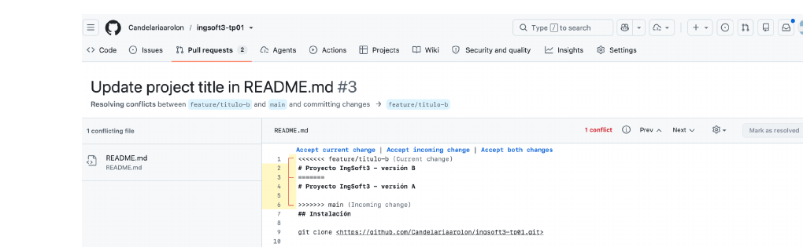

# Evidencias — TP1

## 1. Push directo a main rechazado

GitHub rechaza el push porque `main` está protegida y la regla alcanza también a la administradora del repo (sin bypass).

## 2. Aviso de conflicto en el PR

GitHub avisa que el PR de la rama `feature/titulo-b` no se puede mergear automáticamente porque hay un conflicto con `main`.

## 3. Marcadores del conflicto

El editor de GitHub muestra los marcadores `<<<<<<<`, `=======` y `>>>>>>>` delimitando la versión de cada rama sobre la misma línea del README.

## 4. Release publicada

Tag `v1.0.0` publicado como release en el repositorio, con las notas de qué incluye la entrega.

