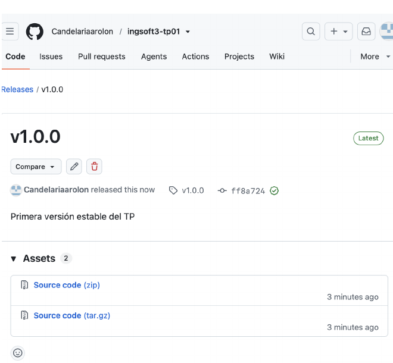
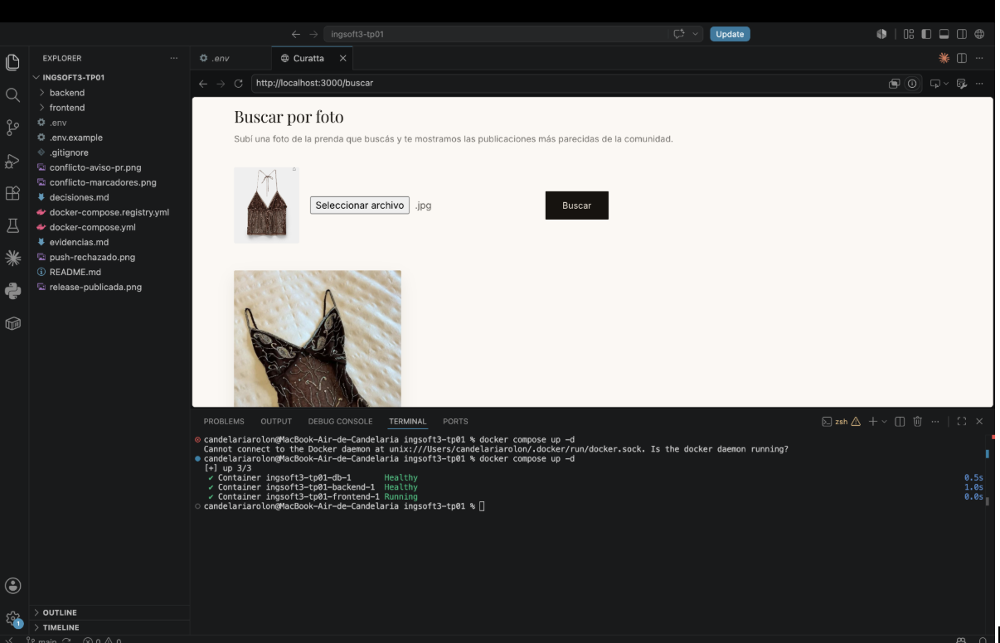
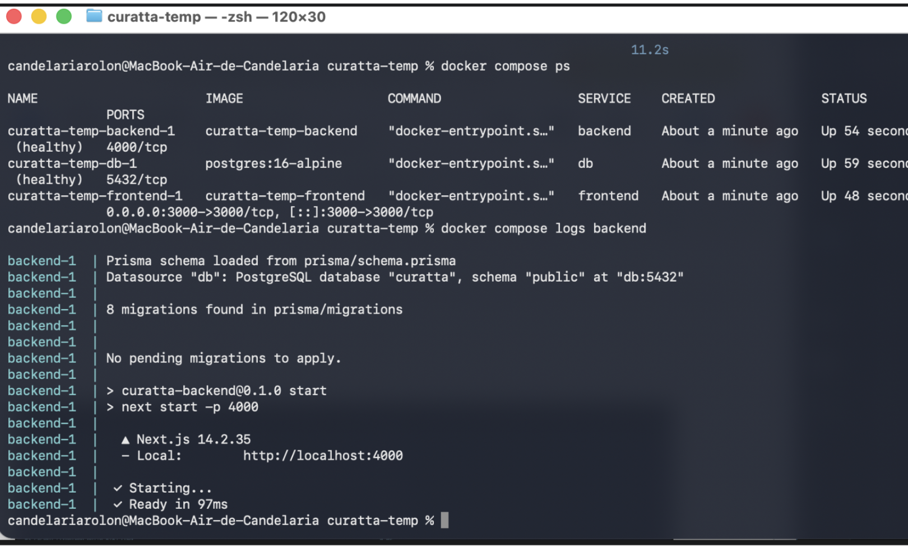
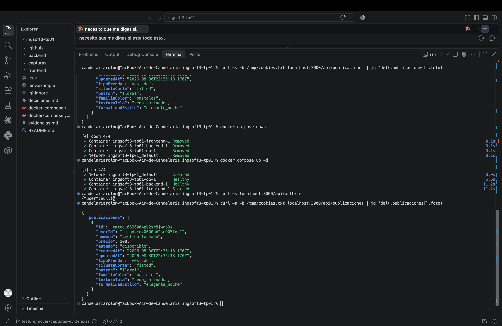
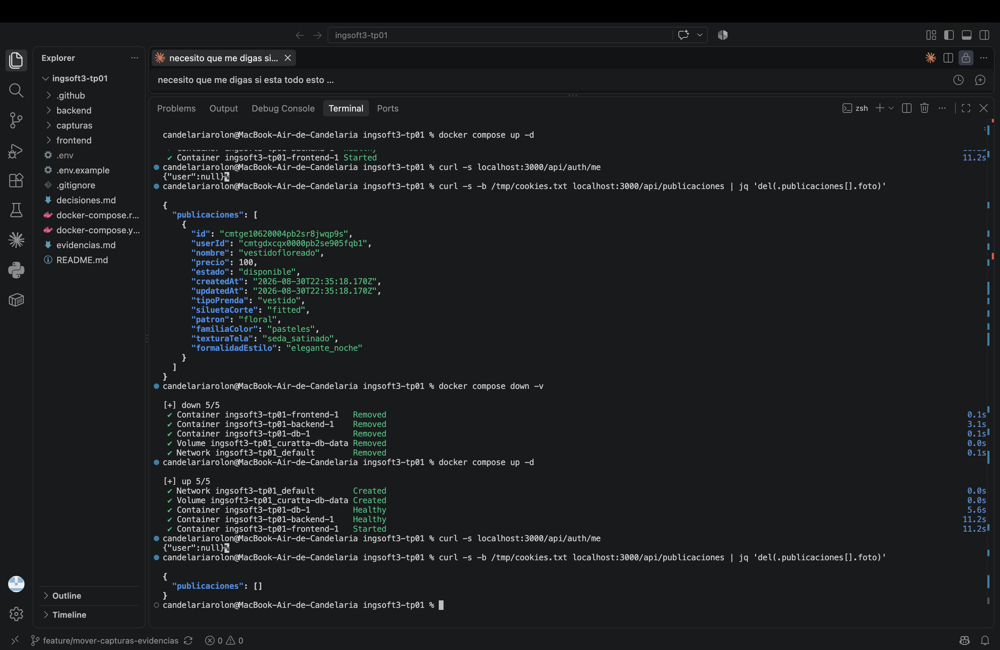
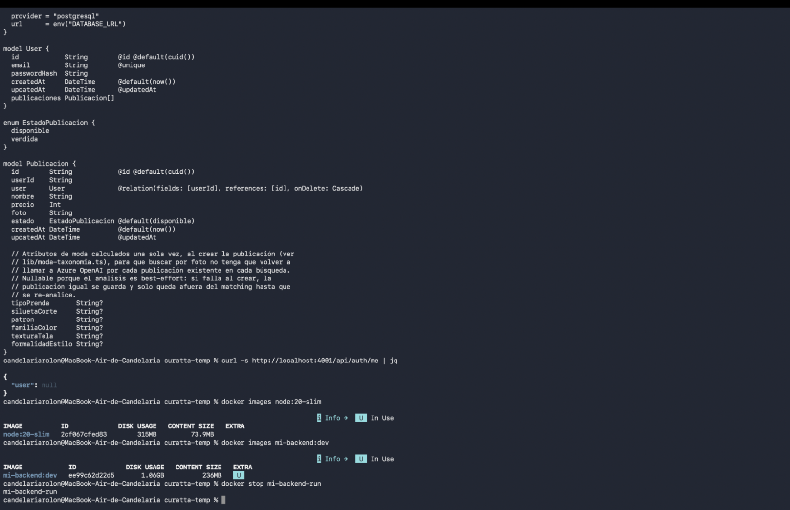
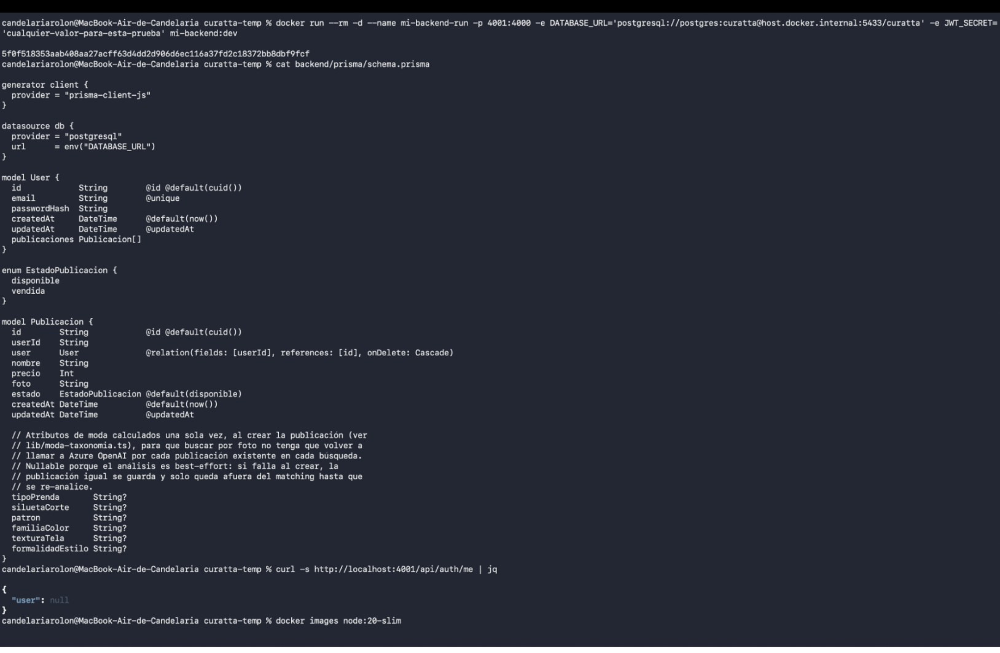
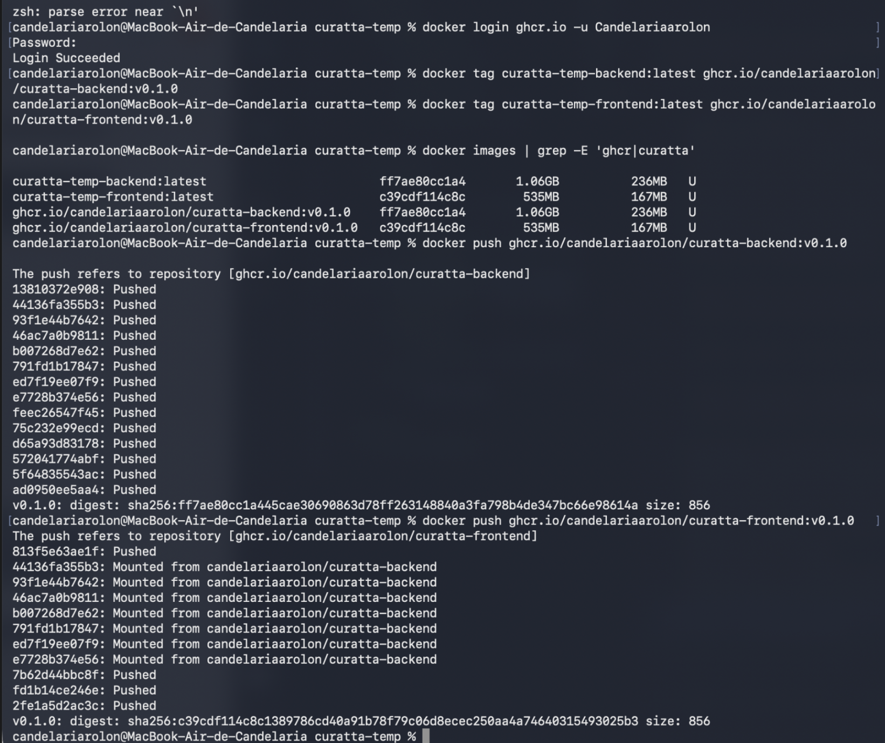
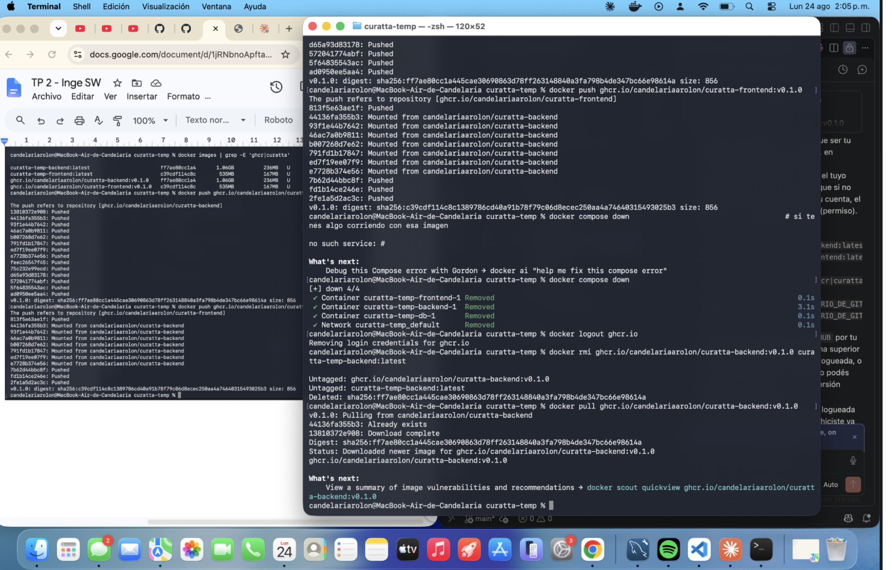

# Evidencias — TP1

## 1. Push directo a main rechazado

GitHub rechaza el push porque `main` está protegida y la regla alcanza también a la administradora del repo (sin bypass).

## 2. Aviso de conflicto en el PR

GitHub avisa que el PR de la rama `feature/titulo-b` no se puede mergear automáticamente porque hay un conflicto con `main`.

## 3. Marcadores del conflicto

El editor de GitHub muestra los marcadores `<<<<<<<`, `=======` y `>>>>>>>` delimitando la versión de cada rama sobre la misma línea del README.

## 4. Release publicada

Tag `v1.0.0` publicado como release en el repositorio, con las notas de qué incluye la entrega.

---

# Evidencias — TP2

## 1. `docker compose up -d` desde cero y el sistema funcionando end-to-end

`docker compose up -d` levanta los tres servicios (`db`, `backend`, `frontend`) desde cero, sin pasos manuales.

`docker compose ps` confirma los tres contenedores en estado `Healthy`/`Running`.

## 2. Prueba de persistencia (`down`/`up` conserva; `down -v` limpia)

Después de `docker compose down` (sin `-v`) y `docker compose up -d`, las publicaciones siguen existiendo: el volumen sobrevive a que se destruyan y recreen los contenedores.

Después de `docker compose down -v`, `GET /api/publicaciones` devuelve vacío: el flag `-v` es el que efectivamente borra los datos.

## 3. Comparación de tamaño: imagen final vs. imagen del SDK

`docker images` comparando el tamaño de la imagen final (la que corre en producción, salida de la etapa `final` del multi-stage build) contra la imagen completa del SDK de Node que se usa en la etapa de `build`.

## 4. Imágenes publicadas en el registry

Las imágenes de backend y frontend publicadas en GHCR, accesibles de forma anónima (`docker pull` sin estar logueada) — confirmando que son públicas.

